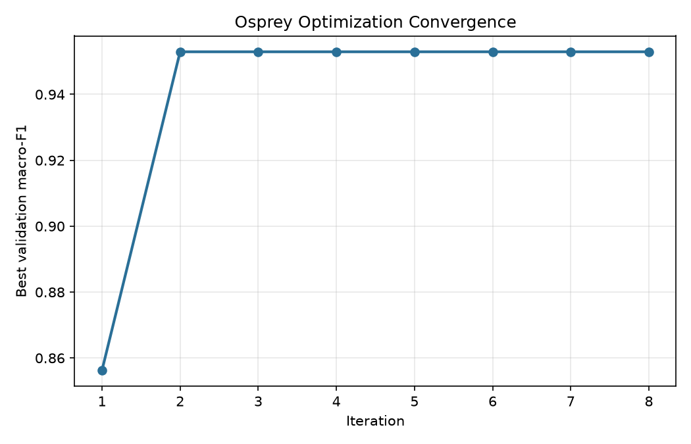
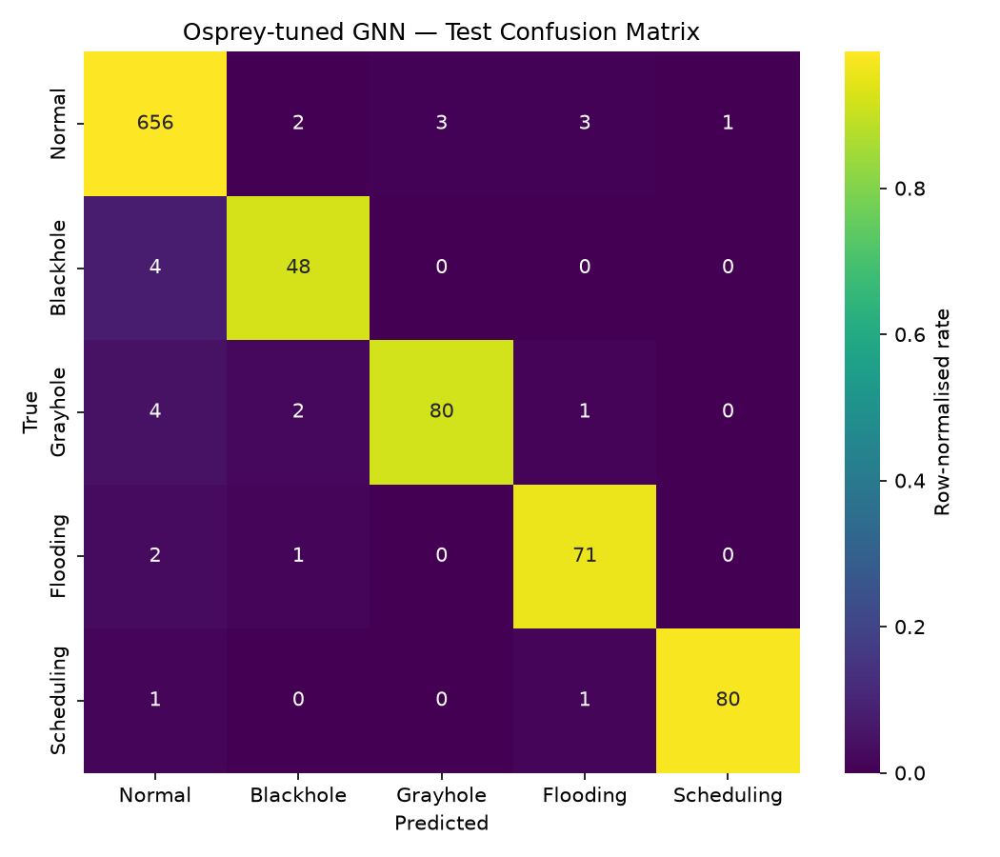
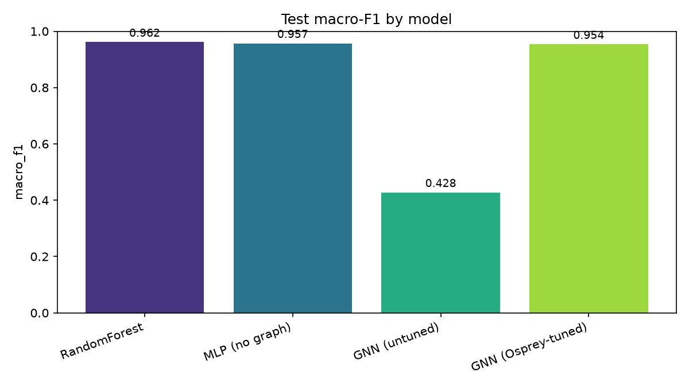

<h1 align="center">Osprey-Optimized Graph Neural Networks<br/>for WSN Intrusion Detection</h1>

<p align="center">
  <b>A novel intrusion-detection system that models a Wireless Sensor Network as a graph,
  detects routing attacks with a Graph Neural Network, and auto-tunes that network with the
  bio-inspired Osprey Optimization Algorithm.</b>
</p>

<p align="center">
  
  
  
  
</p>

---

## ✨ TL;DR

Intrusion detection in Wireless Sensor Networks (WSNs) is usually done with tabular models
that look at each node in isolation. But routing attacks such as **blackholes** and
**grayholes** are only obvious *relative to a node's neighbours*. This project therefore:

1. **Turns each LEACH round into a graph** (sensor nodes + their communication links),
2. **Classifies every node** with a from-scratch **Graph Neural Network (GNN)** that passes
   messages along that topology, and
3. **Automatically tunes the GNN** — layer type, depth, width, dropout, learning rate, weight
   decay — with the **Osprey Optimization Algorithm (OOA)**, a 2023 metaheuristic that mimics
   how a fish-hawk hunts.

The result is a fully reproducible, dependency-light (**no PyTorch-Geometric required**)
pipeline that runs end-to-end with a single command.

```bash
pip install -r requirements.txt
python main.py --all            # generate → optimize → evaluate
python main.py --all --quick    # same, tiny budgets (~1-2 min on CPU)
```

---

## 🧠 Why this is novel

| Conventional WSN-IDS | This project |
|---|---|
| Treats each node-record independently (tabular ML) | Models the **network topology** and reasons about each node **in context** via message passing |
| Hyper-parameters hand-picked or grid-searched | **Osprey Optimization Algorithm** searches the mixed integer/categorical/continuous space automatically |
| Often a single fixed GNN architecture | The optimiser **chooses the architecture itself** (GCN vs GraphSAGE vs GAT, depth, width, …) |
| Heavy framework dependencies | **GNN layers implemented from scratch** in pure PyTorch — transparent and portable |

The two ingredients reinforce each other: the **graph** supplies the right inductive bias for
routing attacks, and **Osprey** finds the GNN configuration that exploits it best.

---

## 🕸️ The problem: routing attacks in LEACH WSNs

WSNs self-organise into clusters under the **LEACH** protocol, rotating the energy-expensive
*Cluster Head (CH)* role. This openness invites four classic routing-layer attacks, which make
up the **WSN-DS** benchmark:

| Class | Signature |
|---|---|
| **Normal** | Honest participation. |
| **Blackhole** | Poses as a CH, attracts traffic, **drops everything** (forwards ≈ 0 to the Base Station). |
| **Grayhole** | Like a blackhole but drops **selectively / partially**. |
| **Flooding** | Emits a **flood of control messages**, exhausting energy. |
| **Scheduling** | **TDMA** attack — manipulates time-slot assignments. |

The IDS must label every *node-in-a-round* as one of these five classes.

---

## 🦅 The Osprey Optimization Algorithm in 30 seconds

An osprey (fish-hawk) hunts in two phases, which OOA turns into the two pillars of search:

- **Phase 1 — dive for the fish (exploration):** move toward a randomly chosen *better*
  population member, `xₙₑw = xᵢ + r·(SF − I·xᵢ)`.
- **Phase 2 — carry the fish (exploitation):** a small, iteration-shrinking local step,
  `xₙₑw = xᵢ + (lb + r·(ub−lb)) / t`.

Each osprey is a GNN hyper-parameter vector; fitness is the GNN's **validation macro-F1**.
Full derivation and pseudocode: [`docs/osprey_algorithm.md`](docs/osprey_algorithm.md).

---

## 🏗️ How it works (pipeline)

```
WSN-DS data ─▶ preprocess ─▶ build per-round graphs ─▶ ┌─────────────────────────────┐
(synthetic                    (cluster + CH-backbone   │  Osprey Optimization loop   │
 or real CSV)                  + spatial kNN edges)     │  position → GNN config →    │
                                                        │  train → val macro-F1 = fit │
                                                        └───────────┬─────────────────┘
                                                                    ▼ best config
                                              final GNN training ─▶ evaluate vs baselines ─▶ results/
```

Detailed, stage-by-stage explanation: **[`docs/methodology.md`](docs/methodology.md)** ·
Architecture & diagrams: **[`docs/architecture.md`](docs/architecture.md)**.

---

## 🚀 Quick start

```bash
# 1. install (CPU PyTorch is fine)
pip install -r requirements.txt

# 2. run the whole thing
python main.py --all                # full run
python main.py --all --quick        # fast demo (~1-2 min)

# 3. or run stages individually
python main.py --generate           # build the dataset
python main.py --optimize           # run the Osprey search  (writes results/best_config.json)
python main.py --evaluate           # final training + baselines (writes results/metrics.json)

# 4. interactive tour
jupyter notebook notebooks/walkthrough.ipynb

# 5. tests
pytest -q
```

### Using the **real** WSN-DS dataset
Download the official `WSN-DS.csv` and drop it into `data/`. The loader auto-detects it (by its
`Attack type` column), maps the original column names onto our schema, and the rest of the
pipeline is unchanged — no code edits needed.

---

## 📊 Results

<!-- RESULTS_TABLE_START -->
_Full run on the synthetic dataset (seed 42). Osprey selected: **SAGE**, 2 layers, hidden=72, dropout=0.06, lr=1.0e-02, wd=1.0e-03 (validation macro-F1 0.957, 102 fitness evaluations). Re-running `python main.py --all` regenerates `results/metrics.json` and the figures._

| Model | Accuracy | Macro-F1 | Macro-Recall |
|---|---|---|---|
| Random Forest (tabular) | 0.979 | 0.962 | 0.954 |
| MLP (no graph) | 0.977 | 0.957 | 0.952 |
| GNN (untuned default) | 0.435 | 0.428 | 0.632 |
| **GNN (Osprey-tuned)** | 0.974 | 0.954 | 0.953 |
<!-- RESULTS_TABLE_END -->

**Figures written to `results/`:**

| Osprey convergence | Confusion matrix | Model comparison |
|---|---|---|
|  |  |  |

> **Interpreting the comparison.**
> - **Osprey adds a lot.** The *untuned default* GNN — a textbook 2-layer **GCN** with
>   dropout 0.5 — collapses to a **0.43 macro-F1** (below the majority-class baseline): the
>   symmetric GCN aggregation *over-smooths* on this dense cluster graph, washing out each
>   node's own discriminative counters. The Osprey search discovers that **GraphSAGE** (which
>   concatenates a node's own features with its neighbourhood mean) plus a **low dropout** avoids
>   this, lifting the same GNN to **0.95 macro-F1**. This architecture/hyper-parameter selection
>   is precisely the value the optimiser provides — a naive GNN choice fails, an *optimised* one
>   does not.
> - **GNN vs tabular.** On the standard WSN-DS-style features the tabular baselines are already
>   strong (these attacks are largely per-node detectable), so the tuned GNN is *competitive*
>   rather than dominant. The GNN's structural advantage is aimed at *contextual / coordinated*
>   attacks and at generalising across unseen network layouts — settings where per-node features
>   alone are insufficient. All models are reported honestly so the trade-offs are visible.

---

## 📁 Repository structure

```
main.py                     # CLI orchestrator (--generate/--optimize/--evaluate/--all/--quick)
config.py                   # all settings; SEARCH_SPACE + decode_position
src/
  data/synthetic.py         # WSN-DS-schema synthetic generator
  data/loader.py            # load & scale synthetic OR real WSN-DS
  graph/builder.py          # per-round graphs → disjoint-union graph + split masks
  models/layers.py          # GCN / GraphSAGE / GAT implemented from scratch
  models/gnn.py             # configurable GNNClassifier
  osprey/optimizer.py       # Osprey Optimization Algorithm
  train.py                  # train/eval one GNN config (the fitness function)
  optimize.py               # OOA ⇄ GNN glue
  evaluate.py               # final model + baselines + plots
  utils.py                  # seeding, metrics, plotting
docs/                       # methodology.md · osprey_algorithm.md · architecture.md
notebooks/walkthrough.ipynb # interactive end-to-end demo
tests/                      # pytest suite (OOA, data, graph, models)
results/                    # generated metrics + figures + checkpoint
```

---

## 🔬 Reproducibility

Everything is seeded (`config.SEED = 42`). `python main.py --all` deterministically regenerates
the dataset, reruns the Osprey search and rewrites every artefact. Budgets live in `config.py`
(`DataConfig`, `OspreyConfig`, `TrainConfig`); `--quick` shrinks them for a fast smoke test.

---

## 📚 References

- Dehghani, M. & Trojovský, P. (2023). *Osprey optimization algorithm: A new bio-inspired
  metaheuristic algorithm for solving optimization problems.* Frontiers in Mechanical
  Engineering, 8, 1126450.
- Almomani, I., Al-Kasasbeh, B. & Al-Akhras, M. (2016). *WSN-DS: A Dataset for Intrusion
  Detection Systems in Wireless Sensor Networks.* Journal of Sensors.
- Kipf, T. & Welling, M. (2017). *Semi-Supervised Classification with Graph Convolutional
  Networks.* ICLR.
- Hamilton, W., Ying, R. & Leskovec, J. (2017). *Inductive Representation Learning on Large
  Graphs (GraphSAGE).* NeurIPS.
- Veličković, P. et al. (2018). *Graph Attention Networks.* ICLR.
- Heinzelman, W., Chandrakasan, A. & Balakrishnan, H. (2000). *Energy-Efficient Communication
  Protocol for Wireless Microsensor Networks (LEACH).* HICSS.

---

## 📝 License

Released under the [MIT License](LICENSE).

<p align="center"><sub>Built as an end-to-end, reproducible research project. Contributions welcome.</sub></p>
