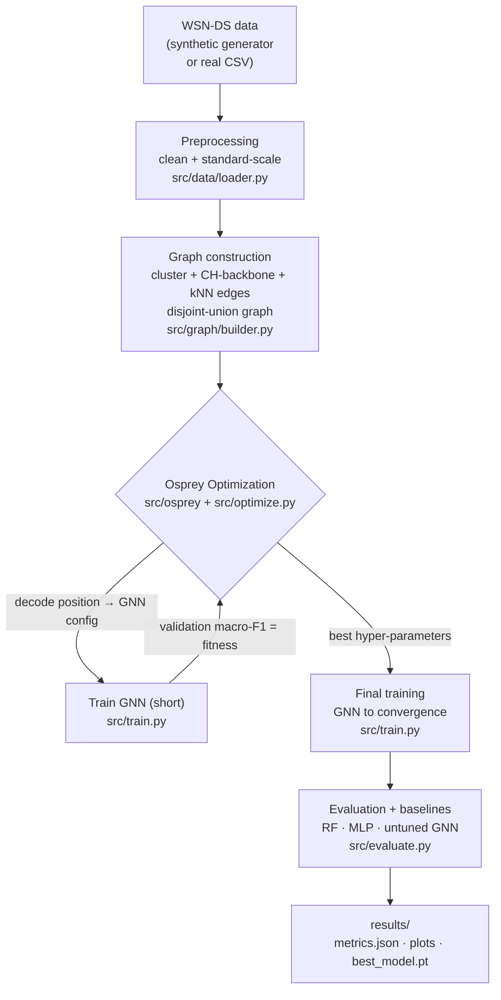
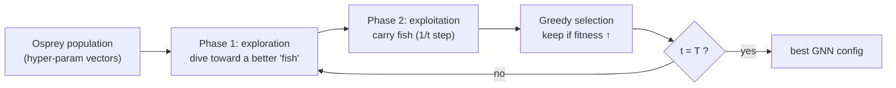
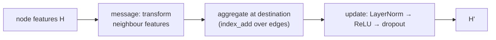

# System Architecture

## End-to-end pipeline



## The optimisation loop



## GNN forward pass (one layer)



## Repository layout

```
.
├── main.py                     # CLI: --generate / --optimize / --evaluate / --all / --quick
├── config.py                   # all knobs; SEARCH_SPACE + decode_position
├── src/
│   ├── data/
│   │   ├── synthetic.py        # WSN-DS-schema synthetic generator
│   │   └── loader.py           # load/scale synthetic OR real WSN-DS
│   ├── graph/
│   │   └── builder.py          # per-round graphs → disjoint-union + split masks
│   ├── models/
│   │   ├── layers.py           # GCN / GraphSAGE / GAT from scratch
│   │   └── gnn.py              # configurable GNNClassifier
│   ├── osprey/
│   │   └── optimizer.py        # Osprey Optimization Algorithm
│   ├── train.py                # train/eval one GNN config (fitness fn)
│   ├── optimize.py             # OOA ⇄ GNN glue
│   ├── evaluate.py             # final model + baselines + plots
│   └── utils.py                # seeding, metrics, plotting
├── docs/                       # methodology.md · osprey_algorithm.md · architecture.md
├── notebooks/walkthrough.ipynb # interactive end-to-end demo
├── tests/                      # pytest suite (OOA, data, graph, models)
└── results/                    # generated metrics + figures + checkpoint
```

## Design choices at a glance

| Choice | Rationale |
|---|---|
| **From-scratch GNN layers** (no PyTorch-Geometric) | Transparent maths; no fragile compiled dependency; installs anywhere with just PyTorch. |
| **Disjoint-union graph** | Full-batch training over all rounds at once; message passing stays inside each round. |
| **Split by round** | Prevents neighbour leakage between train/val/test. |
| **Macro-F1 fitness** | Fair objective under heavy class imbalance (attacks are rare). |
| **Log-scaled lr / weight-decay in the search space** | Linear OOA moves explore multiplicative quantities uniformly. |
| **Synthetic generator + real-CSV loader** | Runs end-to-end with zero downloads, yet drops straight onto real WSN-DS. |
